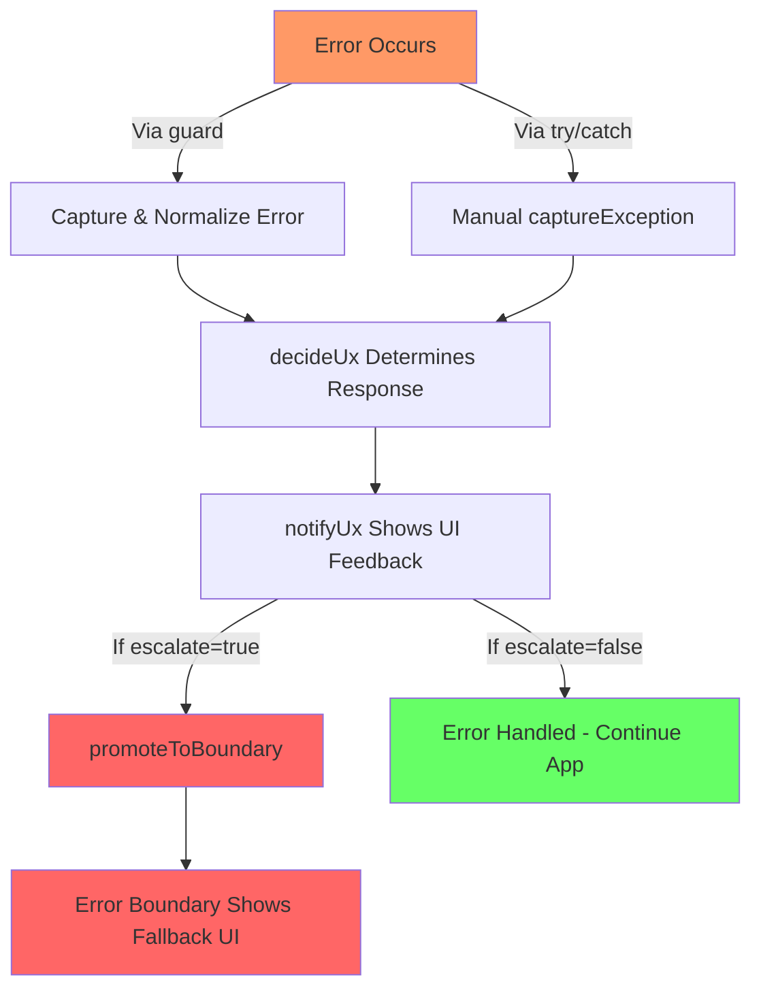

# Error Handling Toolkit

This toolkit centralizes how the app detects, classifies, surfaces, and collects feedback about runtime failures. It keeps error semantics consistent across native and web targets while staying agnostic of the telemetry backend (console logging, Sentry, etc.).

## Architecture

- **Errors (`errors/`)**  
  `AppError` augments native errors with a `kind`, optional `code/status`, and `severity`. Factory helpers (`authError`, `networkError`, `validationError`, `invariantError`) standardize error creation, and `normalizeUnknown` converts arbitrary thrown values into `AppError` instances.

- **Policy (`errors/policy.ts`)**  
  `decideUx` translates an `AppError` into a UI decision: escalate to the fatal boundary or show a lightweight message (`userMessage`).

- **Capture Helpers (`helpers/capture.ts`)**
  - `captureException` normalizes, logs, tags, forwards to the feedback service, and optionally escalates.
  - `guard` (aliased as `guardAsync`) wraps handlers so synchronous throws are captured and only rethrown when policy escalates, while rejected promises resolve to a fallback when non-fatal.
  - `installGlobalErrorHandlers` hooks React Native `ErrorUtils`, `window.onerror`, and `unhandledrejection`.
  - `registerFatalPromoter` / `promoteToBoundary` bridge fatals into the active error boundary UI.
  - `registerUxNotifier` / `notifyUx` let you plug a global notifier (toast, banner, etc.) for non-escalated errors.

- **Feedback (`feedback/`)**  
  `FeedbackService` abstracts telemetry destinations. `ConsoleFeedbackService` logs locally; `SentryFeedbackService` is scaffolded for future integration.

- **UI (`ui/`)**  
  `ErrorFallback` renders the fatal state and offers retry/report actions. `FeedbackModal` collects user reports; once `reportFeedback` is wired it will submit via the capture helpers.

- **Hosts**
  - `FeedbackHost` mounts the feedback modal and exposes `requestFeedbackModal`.
  - `ErrorNotificationsHost` registers the global toast notifier so every non-escalated error shows a centered, dismissible message without per-screen boilerplate.

## Global Flow

Run during app bootstrap so uncaught errors, promise rejections, and RN/browser events are captured. ErrorNotificationsHost calls registerUxNotifier automatically when mounted.

_Capture & Telemetry_
Every error is normalized `(normalizeUnknown)`, enriched with contextual tags, logged, and forwarded to the configured FeedbackService.

_Policy Application_
decideUx decides whether to escalate. When escalate is true, promoteToBoundary triggers the fallback UI; otherwise surfaces should present userMessage (the default toast handles this automatically).
Integrations like the `useAPI` hook mark only transient transport failures as retryable, so the notifier can distinguish “connection hiccup” copy from validation or auth issues without additional UI branching.

_User Feedback_
Users can open the feedback modal via `requestFeedbackModal`, ensuring even non-fatal issues can be reported.

## Getting Started

1. Wrap the App

   ```tsx
   <GluestackUIProvider mode={colorMode}>
     <ErrorNotificationsHost>
       <FeedbackHost>{/* navigation/providers */}</FeedbackHost>
     </ErrorNotificationsHost>
   </GluestackUIProvider>
   ```

2. Install Global Hooks

This will be called once in the root when the app loads

```ts
installGlobalErrorHandlers({ escalateUnhandled: true });
registerFatalPromoter(promoteToBoundary);
```

- **Suppressing noisy globals:** `installGlobalErrorHandlers` lets you silence specific native/runtime
  error messages. Copy the exact console string into `IGNORED_GLOBAL_ERROR_STRINGS` to mute it.
  The filter is on when `EXPO_PUBLIC_SUPPRESS_GLOBAL_ERRORS` is missing or set to `true`; set it to
  `false` to surface every error without touching code.

- Wrap handlers and effects with guard/guardAsync; the Babel plugin auto-injects a `where` tag for observability.
- For manual try/catch blocks, call captureException, then feed the result into `decideUx` + `notifyUx`.
- Invoke `promoteToBoundary(appError)` or pass `{ escalate: true }` when you need the fatal fallback immediately.
- Swap ConsoleFeedbackService with a production implementation when ready and keep tagging errors with structured metadata so downstream dashboards stay useful.

### Using `useMemo` with `guard`

`guard` returns a brand-new wrapped function each time it is called. When you pass that wrapper to components or hooks that compare by reference (e.g., `Button` handlers, `useEffect` dependencies), re-creating it every render can trigger extra work or re-subscriptions. Wrapping the guard call in `useMemo` keeps the handler identity stable until one of its dependencies changes, which avoids unnecessary cleanup/re-register cycles => important when the handler wires up API calls, analytics, or listeners.

Use `useMemo` (or `useCallback`) around `guard` when:

- you plan to pass the guarded handler as a prop to child components that expect stable identities;
- the handler should only be re-created when explicit dependencies change (e.g., it closes over state values written in the dependency list);
- you register the handler with a subscription API (`useEffect`, event listeners) and want clean teardown semantics.

Skip `useMemo` when:

- the guarded code needs fresh closure scope every render (e.g., it reads transient props or state without listing dependencies);
- you trigger the guard inline once (e.g., inside a click handler body) and do not reuse the function reference;
- the surrounding component re-renders infrequently and the extra memoization adds needless complexity.

## How it works



**Example Screen**

```tsx
import ScreenView from "@/components/Tools/ScreenView";
import { Box } from "@/components/ui/box";
import { Button, ButtonText } from "@/components/ui/button";
import { Text } from "@/components/ui/text";
import {
  Toast,
  ToastDescription,
  ToastTitle,
  useToast,
} from "@/components/ui/toast";
import {
  authError,
  invariantError,
  networkError,
  validationError,
} from "@/utils/ErrorHandling/errors/types";
import axios, { Method } from "axios";
import React, { useCallback, useMemo, useState } from "react";
import { guard } from "utils/ErrorHandling/helpers/capture";

type ButtonAction = () => void | Promise<unknown>;

type ExampleConfig = {
  key: string;
  label: string;
  action: ButtonAction;
  actionStyle?: "primary" | "secondary" | "negative" | "positive";
};

/**
 * Developer-only playground that triggers each error factory and guard path so the
 * error-handling stack (capture, policy, UX notifications) can be exercised end-to-end.
 */
const SANDBOX_FALLBACK_BASE_URL = "https://httpstat.us";
const SANDBOX_API_BASE_URL =
  process.env.EXPO_PUBLIC_SANDBOX_API_BASE_URL ?? SANDBOX_FALLBACK_BASE_URL;
const sandboxHttp = axios.create({
  baseURL: SANDBOX_API_BASE_URL,
  timeout: 4500,
  headers: { Accept: "text/plain" },
});

type SandboxCallArgs = {
  url: string;
  method?: Method;
  body?: Record<string, unknown>;
};

const ROUTE_STATUS_MAP: Record<string, { success: number; failure?: number }> =
  {
    "/users/sandbox/test": { success: 200, failure: 500 },
    "/auth/login": { success: 200, failure: 401 },
  };

const resolveSandboxStatus = (url: string, shouldError: boolean) => {
  const entry = ROUTE_STATUS_MAP[url];
  if (shouldError) {
    return entry?.failure ?? 500;
  }
  return entry?.success ?? 200;
};

export default function ErrorTesting() {
  const [showBuggyComponent, setShowBuggyComponent] = useState(false);
  const toast = useToast();

  const showSandboxToast = useCallback(
    (action: "success" | "error", title: string, description: string) => {
      toast.show({
        placement: "bottom",
        render: ({ id }) => (
          <Toast nativeID={`toast-${id}`} action={action} variant="solid">
            <ToastTitle>{title}</ToastTitle>
            <ToastDescription>{description}</ToastDescription>
          </Toast>
        ),
      });
    },
    [toast]
  );

  const authExamples = useMemo<ExampleConfig[]>(
    () => [
      {
        key: "auth-session-expired",
        label: "Auth • Session expired",
        action: guard(() => {
          throw authError("Session expired (demo)", {
            code: "AUTH_SESSION_EXPIRED",
            status: 401,
          });
        }),
      },
      {
        key: "auth-email-unverified",
        label: "Auth • Email unverified",
        action: guard(() => {
          throw authError("Email not verified (demo)", {
            code: "AUTH_EMAIL_UNVERIFIED",
            status: 401,
          });
        }),
      },
      {
        key: "auth-provider-mismatch",
        label: "Auth • Provider mismatch",
        action: guard(() => {
          throw authError("Provider mismatch (demo)", {
            code: "AUTH_PROVIDER_MISMATCH",
            metadata: { expected: "google", actual: "apple" },
          });
        }),
      },
      {
        key: "auth-login-required",
        label: "Auth • Login required",
        action: guard(() => {
          throw authError("Login required (demo)", {
            code: "AUTH_LOGIN_REQUIRED",
          });
        }),
      },
      {
        key: "auth-cancelled",
        label: "Auth • Cancelled",
        action: guard(() => {
          throw authError("Authentication cancelled (demo)", {
            code: "AUTH_CANCELLED",
          });
        }),
      },
      {
        key: "auth-request-failed",
        label: "Auth • Request failed",
        action: guard(() => {
          throw authError("Authentication failed (demo)", {
            code: "AUTH_REQUEST_FAILED",
            status: 500,
          });
        }),
      },
    ],
    []
  );

  const validationExamples = useMemo<ExampleConfig[]>(
    () => [
      {
        key: "validation-required",
        label: "Validation • Required",
        action: guard(() => {
          throw validationError("Name is required (demo)", {
            code: "VALIDATION_REQUIRED",
          });
        }),
      },
      {
        key: "validation-pattern",
        label: "Validation • Pattern mismatch",
        action: guard(() => {
          throw validationError("Phone number format mismatch (demo)", {
            code: "VALIDATION_PATTERN_MISMATCH",
          });
        }),
      },
      {
        key: "validation-range",
        label: "Validation • Out of range",
        action: guard(() => {
          throw validationError("Value out of range (demo)", {
            code: "VALIDATION_OUT_OF_RANGE",
          });
        }),
      },
      {
        key: "validation-unique",
        label: "Validation • Unique constraint",
        action: guard(() => {
          throw validationError("Email already taken (demo)", {
            code: "VALIDATION_UNIQUE",
          });
        }),
      },
      {
        key: "validation-conflict",
        label: "Validation • Conflict",
        action: guard(() => {
          throw validationError("Conflicting selections (demo)", {
            code: "VALIDATION_CONFLICT",
          });
        }),
      },
    ],
    []
  );

  const networkExamples = useMemo<ExampleConfig[]>(
    () => [
      {
        key: "network-offline",
        label: "Network • Offline",
        action: guard(() => {
          throw networkError("Offline (demo)", {
            status: 0,
            retryable: false,
            metadata: { reason: "offline" },
          });
        }),
      },
      {
        key: "network-404",
        label: "Network • 404 Not Found",
        action: guard(() => {
          throw networkError("Resource missing (demo)", 404);
        }),
      },
      {
        key: "network-500",
        label: "Network • 500 Server error",
        action: guard(() => {
          throw networkError("Server exploded (demo)", 500);
        }),
      },
      {
        key: "network-retryable",
        label: "Network • Retryable timeout",
        action: guard(() => {
          throw networkError("Timeout (demo)", {
            status: 503,
            retryable: true,
            attempt: 1,
          });
        }),
      },
    ],
    []
  );

  const invariantExamples = useMemo<ExampleConfig[]>(
    () => [
      {
        key: "invariant-state",
        label: "Invariant • State corrupted",
        action: guard(() => {
          throw invariantError("State corrupted (demo)", {
            code: "INVARIANT_STATE_CORRUPTED",
          });
        }),
        actionStyle: "negative",
      },
      {
        key: "invariant-unreachable",
        label: "Invariant • Unreachable",
        action: guard(() => {
          throw invariantError("Reached unreachable code (demo)", {
            code: "INVARIANT_UNREACHABLE",
          });
        }),
        actionStyle: "negative",
      },
      {
        key: "invariant-unsupported",
        label: "Invariant • Unsupported feature",
        action: guard(() => {
          throw invariantError("Unsupported feature (demo)", {
            code: "INVARIANT_UNSUPPORTED",
          });
        }),
        actionStyle: "negative",
      },
    ],
    []
  );

  const miscExamples = useMemo<ExampleConfig[]>(
    () => [
      {
        key: "render-bug",
        label: "Render • Trigger component crash",
        action: guard(() => setShowBuggyComponent(true)),
        actionStyle: "negative",
      },
      {
        key: "unguarded-throw",
        label: "Throw • Unguarded Error",
        action: () => {
          throw new Error("A wild error instance appeared!");
        },
        actionStyle: "negative",
      },
    ],
    []
  );

  const callSandboxApi = useCallback(
    async ({ url, method = "GET", body }: SandboxCallArgs) => {
      const shouldThrow =
        typeof body === "object" && body !== null
          ? Boolean((body as { throwError?: boolean }).throwError)
          : false;

      const status = resolveSandboxStatus(url, shouldThrow);
      const isFallbackBase = SANDBOX_API_BASE_URL === SANDBOX_FALLBACK_BASE_URL;
      const sleep = status >= 500 ? 1400 : 650;
      const targetUrl = isFallbackBase ? `/${status}?sleep=${sleep}` : url;

      try {
        const response = await sandboxHttp.request({
          url: targetUrl,
          method,
          data: body,
        });
        return response.data;
      } catch (error) {
        if (axios.isAxiosError(error)) {
          throw networkError(error.message || "Sandbox request failed", {
            status: error.response?.status ?? status,
            method,
            url,
            retryable: error.code === "ECONNABORTED",
            metadata: { simulatedUrl: targetUrl },
          });
        }
        throw error;
      }
    },
    []
  );

  const sandboxExamples = useMemo<ExampleConfig[]>(
    () => [
      {
        key: "sandbox-success",
        label: "Sandbox API • Success",
        action: guard(async () => {
          try {
            const response = await callSandboxApi({
              url: "/users/sandbox/test",
              method: "POST",
              body: { throwError: false },
            });
            console.log(
              "Sandbox API • Success => response",
              response ?? "(no payload)"
            );
            showSandboxToast(
              "success",
              "Sandbox call succeeded",
              "Test endpoint responded successfully."
            );
          } catch (error) {
            console.error("Sandbox API • Success → failure", error);
            showSandboxToast(
              "error",
              "Sandbox call failed",
              "Check logs for the error details."
            );
            throw error;
          }
        }),
        actionStyle: "positive",
      },
      {
        key: "sandbox-failure",
        label: "Sandbox API • Failure",
        action: guard(async () => {
          await callSandboxApi({
            url: "/users/sandbox/test",
            method: "POST",
            body: { throwError: true },
          });
        }),
        actionStyle: "negative",
      },
      {
        key: "sandbox-login",
        label: "Sandbox API • Login",
        action: guard(async () => {
          await callSandboxApi({
            url: "/auth/login",
            method: "POST",
          });
        }),
        actionStyle: "primary",
      },
    ],
    [callSandboxApi, showSandboxToast]
  );

  return (
    <ScreenView>
      <Box className="gap-5 p-4">
        <ExampleSection title="Authentication Errors" examples={authExamples} />
        <ExampleSection
          title="Validation Errors"
          examples={validationExamples}
        />
        <ExampleSection title="Network Errors" examples={networkExamples} />
        <ExampleSection title="Invariant Errors" examples={invariantExamples} />
        <ExampleSection title="Sandbox API Calls" examples={sandboxExamples} />
        <ExampleSection title="Miscellaneous" examples={miscExamples} />
        {showBuggyComponent && <BuggyComponent />}
      </Box>
    </ScreenView>
  );
}

function ExampleSection({
  title,
  examples,
}: {
  title: string;
  examples: ExampleConfig[];
}) {
  return (
    <Box className="gap-3">
      <Text className="text-base font-semibold">{title}</Text>
      {examples.map(({ key, label, action, actionStyle = "primary" }) => (
        <Button key={key} action={actionStyle} onPress={action}>
          <ButtonText>{label}</ButtonText>
        </Button>
      ))}
    </Box>
  );
}

function BuggyComponent() {
  const users = [
    { id: 1, name: "Alice", avatar: { url: "123" } },
    { id: 2, name: "Bob" },
  ];

  return (
    <Box className="mt-4">
      <Text className="text-base font-semibold">
        Buggy component (throws render error)
      </Text>
      {users.map((u) => (
        <Text key={u.id}>{u.avatar.url}</Text>
      ))}
    </Box>
  );
}
```
