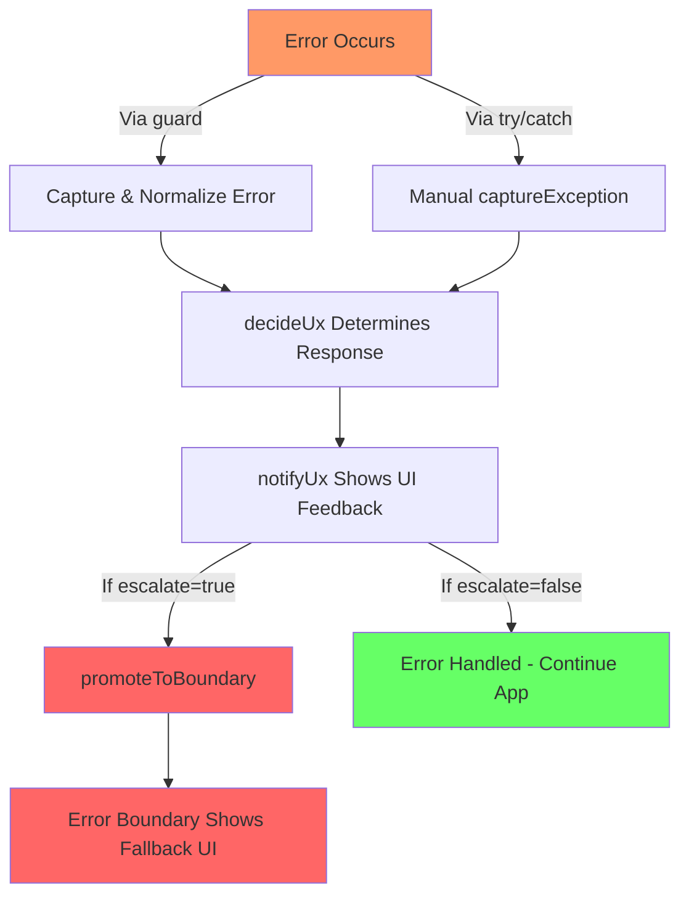

# Error Handling Toolkit

This toolkit centralizes how the app detects, classifies, surfaces, and collects feedback about runtime failures. It keeps error semantics consistent across native and web targets while staying agnostic of the telemetry backend (console logging, Sentry, etc.).

## Architecture

- **Errors (`errors/`)**  
  `AppError` augments native errors with a `kind`, optional `code/status`, and `severity`. Factory helpers (`authError`, `networkError`, `validationError`, `invariantError`) standardize error creation, and `normalizeUnknown` converts arbitrary thrown values into `AppError` instances.

- **Policy (`errors/policy.ts`)**  
  `decideUx` translates an `AppError` into a UI decision: escalate to the fatal boundary or show a lightweight message (`userMessage`).

- **Capture Helpers (`helpers/capture.ts`)**
  - `captureException` normalizes, logs, tags, forwards to the feedback service, and optionally escalates.
  - `guard` (aliased as `guardAsync`) wraps handlers so synchronous throws are captured and only rethrown when policy escalates, while rejected promises resolve to a fallback when non-fatal.
  - `installGlobalErrorHandlers` hooks React Native `ErrorUtils`, `window.onerror`, and `unhandledrejection`.
  - `registerFatalPromoter` / `promoteToBoundary` bridge fatals into the active error boundary UI.
  - `registerUxNotifier` / `notifyUx` let you plug a global notifier (toast, banner, etc.) for non-escalated errors.

- **Feedback (`feedback/`)**  
  `FeedbackService` abstracts telemetry destinations. `ConsoleFeedbackService` logs locally; `SentryFeedbackService` is scaffolded for future integration.

- **UI (`ui/`)**  
  `ErrorFallback` renders the fatal state and offers retry/report actions. `FeedbackModal` collects user reports; once `reportFeedback` is wired it will submit via the capture helpers.

- **Hosts**
  - `FeedbackHost` mounts the feedback modal and exposes `requestFeedbackModal`.
  - `ErrorNotificationsHost` registers the global toast notifier so every non-escalated error shows a centered, dismissible message without per-screen boilerplate.

## Global Flow

Run during app bootstrap so uncaught errors, promise rejections, and RN/browser events are captured. ErrorNotificationsHost calls registerUxNotifier automatically when mounted.

_Capture & Telemetry_
Every error is normalized `(normalizeUnknown)`, enriched with contextual tags, logged, and forwarded to the configured FeedbackService.

_Policy Application_
decideUx decides whether to escalate. When escalate is true, promoteToBoundary triggers the fallback UI; otherwise surfaces should present userMessage (the default toast handles this automatically).
Integrations like the `useAPI` hook mark only transient transport failures as retryable, so the notifier can distinguish “connection hiccup” copy from validation or auth issues without additional UI branching.

_User Feedback_
Users can open the feedback modal via `requestFeedbackModal`, ensuring even non-fatal issues can be reported.

## Getting Started

1. Wrap the App

   ```tsx
   <GluestackUIProvider mode={colorMode}>
   	<ErrorNotificationsHost>
   		<FeedbackHost>{/* navigation/providers */}</FeedbackHost>
   	</ErrorNotificationsHost>
   </GluestackUIProvider>
   ```

2. Install Global Hooks

This will be called once in the root when the app loads

```ts
installGlobalErrorHandlers({ escalateUnhandled: true });
registerFatalPromoter(promoteToBoundary);
```

- **Suppressing noisy globals:** `installGlobalErrorHandlers` lets you silence specific native/runtime
  error messages. Copy the exact console string into `IGNORED_GLOBAL_ERROR_STRINGS` to mute it.
  The filter is on when `EXPO_PUBLIC_SUPPRESS_GLOBAL_ERRORS` is missing or set to `true`; set it to
  `false` to surface every error without touching code.

- Wrap handlers and effects with guard/guardAsync; the Babel plugin auto-injects a `where` tag for observability.
- For manual try/catch blocks, call captureException, then feed the result into `decideUx` + `notifyUx`.
- Invoke `promoteToBoundary(appError)` or pass `{ escalate: true }` when you need the fatal fallback immediately.
- Swap ConsoleFeedbackService with a production implementation when ready and keep tagging errors with structured metadata so downstream dashboards stay useful.

### Using `useMemo` with `guard`

`guard` returns a brand-new wrapped function each time it is called. When you pass that wrapper to components or hooks that compare by reference (e.g., `Button` handlers, `useEffect` dependencies), re-creating it every render can trigger extra work or re-subscriptions. Wrapping the guard call in `useMemo` keeps the handler identity stable until one of its dependencies changes, which avoids unnecessary cleanup/re-register cycles => important when the handler wires up API calls, analytics, or listeners.

Use `useMemo` (or `useCallback`) around `guard` when:

- you plan to pass the guarded handler as a prop to child components that expect stable identities;
- the handler should only be re-created when explicit dependencies change (e.g., it closes over state values written in the dependency list);
- you register the handler with a subscription API (`useEffect`, event listeners) and want clean teardown semantics.

Skip `useMemo` when:

- the guarded code needs fresh closure scope every render (e.g., it reads transient props or state without listing dependencies);
- you trigger the guard inline once (e.g., inside a click handler body) and do not reuse the function reference;
- the surrounding component re-renders infrequently and the extra memoization adds needless complexity.

## How it works



**Example Screen**

```tsx
import ScreenView from '@/components/Tools/ScreenView';
import { useAppToast } from '@/components/common/AppToastProvider';
import {
	authError,
	invariantError,
	networkError,
	validationError,
} from '@/utils/ErrorHandling/errors/types';
import axios, { Method, isAxiosError } from 'axios';
import React, { useCallback, useMemo, useState } from 'react';
import { StyleSheet, View } from 'react-native';
import { Button, Card, Divider, Text } from 'react-native-paper';
import { guard } from 'utils/ErrorHandling/helpers/capture';

type ButtonAction = () => void | Promise<unknown>;

type ExampleConfig = {
	key: string;
	label: string;
	action: ButtonAction;
};

const SANDBOX_FALLBACK_BASE_URL = 'https://httpstat.us';
const SANDBOX_API_BASE_URL =
	process.env.EXPO_PUBLIC_SANDBOX_API_BASE_URL ?? SANDBOX_FALLBACK_BASE_URL;
const sandboxHttp = axios.create({
	baseURL: SANDBOX_API_BASE_URL,
	timeout: 4500,
	headers: { Accept: 'text/plain' },
});

const ROUTE_STATUS_MAP: Record<string, { success: number; failure?: number }> =
	{
		'/users/sandbox/test': { success: 200, failure: 500 },
		'/auth/login': { success: 200, failure: 401 },
	};

const resolveSandboxStatus = (url: string, shouldError: boolean) => {
	const entry = ROUTE_STATUS_MAP[url];
	if (shouldError) {
		return entry?.failure ?? 500;
	}
	return entry?.success ?? 200;
};

type SandboxCallArgs = {
	url: string;
	method?: Method;
	body?: Record<string, unknown>;
};

const ExampleCard = ({
	title,
	description,
	examples,
}: {
	title: string;
	description?: string;
	examples: ExampleConfig[];
}) => (
	<Card style={styles.card}>
		<Card.Title title={title} subtitle={description} />
		<Card.Content>
			<View style={styles.cardContent}>
				{examples.map((example) => (
					<Button
						key={example.key}
						mode="outlined"
						onPress={example.action}
						accessibilityLabel={example.label}
					>
						{example.label}
					</Button>
				))}
			</View>
		</Card.Content>
	</Card>
);

export default function ErrorTesting() {
	const { showToast } = useAppToast();

	const throwAuthSessionExpired = useMemo(
		() =>
			guard(() => {
				throw authError('Session expired (demo)', {
					code: 'AUTH_SESSION_EXPIRED',
					status: 401,
				});
			}),
		[]
	);
	const throwAuthEmailUnverified = useMemo(
		() =>
			guard(() => {
				throw authError('Email not verified (demo)', {
					code: 'AUTH_EMAIL_UNVERIFIED',
					status: 401,
				});
			}),
		[]
	);
	const throwAuthProviderMismatch = useMemo(
		() =>
			guard(() => {
				throw authError('Provider mismatch (demo)', {
					code: 'AUTH_PROVIDER_MISMATCH',
					metadata: { expected: 'google', actual: 'apple' },
				});
			}),
		[]
	);
	const throwAuthLoginRequired = useMemo(
		() =>
			guard(() => {
				throw authError('Login required (demo)', {
					code: 'AUTH_LOGIN_REQUIRED',
				});
			}),
		[]
	);
	const throwAuthCancelled = useMemo(
		() =>
			guard(() => {
				throw authError('Authentication cancelled (demo)', {
					code: 'AUTH_CANCELLED',
				});
			}),
		[]
	);
	const throwAuthRequestFailed = useMemo(
		() =>
			guard(() => {
				throw authError('Authentication failed (demo)', {
					code: 'AUTH_REQUEST_FAILED',
					status: 500,
				});
			}),
		[]
	);

	const throwValidationRequired = useMemo(
		() =>
			guard(() => {
				throw validationError('Name is required (demo)', {
					code: 'VALIDATION_REQUIRED',
				});
			}),
		[]
	);
	const throwValidationPattern = useMemo(
		() =>
			guard(() => {
				throw validationError('Phone number format mismatch (demo)', {
					code: 'VALIDATION_PATTERN_MISMATCH',
				});
			}),
		[]
	);
	const throwValidationRange = useMemo(
		() =>
			guard(() => {
				throw validationError('Value out of range (demo)', {
					code: 'VALIDATION_OUT_OF_RANGE',
				});
			}),
		[]
	);
	const throwValidationUnique = useMemo(
		() =>
			guard(() => {
				throw validationError('Email already taken (demo)', {
					code: 'VALIDATION_UNIQUE',
				});
			}),
		[]
	);
	const throwValidationConflict = useMemo(
		() =>
			guard(() => {
				throw validationError('Conflicting selections (demo)', {
					code: 'VALIDATION_CONFLICT',
				});
			}),
		[]
	);

	const throwNetworkOffline = useMemo(
		() =>
			guard(() => {
				throw networkError('Offline (demo)', {
					status: 0,
					retryable: false,
					metadata: { reason: 'offline' },
				});
			}),
		[]
	);
	const throwNetwork404 = useMemo(
		() =>
			guard(() => {
				throw networkError('Not found (demo)', {
					status: 404,
					retryable: false,
				});
			}),
		[]
	);
	const throwNetworkTimeout = useMemo(
		() =>
			guard(() => {
				throw networkError('Request timed out (demo)', {
					status: 408,
					retryable: true,
				});
			}),
		[]
	);

	const throwInvariant = useMemo(
		() =>
			guard(() => {
				throw invariantError('Invariant violated (demo)');
			}),
		[]
	);

	const callSandbox = useCallback(
		async (
			{ url, method = 'GET', body }: SandboxCallArgs,
			shouldError = false
		) => {
			const status = resolveSandboxStatus(url, shouldError);
			const fullUrl = `${url}?status=${status}`;
			try {
				await sandboxHttp.request({
					url: fullUrl,
					method,
					data: body,
				});
				showToast('Sandbox call succeeded');
			} catch (error) {
				if (isAxiosError(error)) {
					throw networkError(error.message, {
						status: error.response?.status,
						retryable: true,
					});
				}
				throw error;
			}
		},
		[showToast]
	);

	const sections: {
		title: string;
		description?: string;
		examples: ExampleConfig[];
	}[] = [
		{
			title: 'Authentication errors',
			description: 'Trigger guard flows for different auth scenarios.',
			examples: [
				{
					key: 'auth-session',
					label: 'Session expired',
					action: throwAuthSessionExpired,
				},
				{
					key: 'auth-email',
					label: 'Email unverified',
					action: throwAuthEmailUnverified,
				},
				{
					key: 'auth-provider',
					label: 'Provider mismatch',
					action: throwAuthProviderMismatch,
				},
				{
					key: 'auth-login',
					label: 'Login required',
					action: throwAuthLoginRequired,
				},
				{ key: 'auth-cancel', label: 'Cancelled', action: throwAuthCancelled },
				{
					key: 'auth-failed',
					label: 'Request failed',
					action: throwAuthRequestFailed,
				},
			],
		},
		{
			title: 'Validation errors',
			description: 'Test validation error factories.',
			examples: [
				{
					key: 'validation-required',
					label: 'Required field',
					action: throwValidationRequired,
				},
				{
					key: 'validation-pattern',
					label: 'Pattern mismatch',
					action: throwValidationPattern,
				},
				{
					key: 'validation-range',
					label: 'Range violation',
					action: throwValidationRange,
				},
				{
					key: 'validation-unique',
					label: 'Unique violation',
					action: throwValidationUnique,
				},
				{
					key: 'validation-conflict',
					label: 'Conflict',
					action: throwValidationConflict,
				},
			],
		},
		{
			title: 'Network errors',
			examples: [
				{
					key: 'network-offline',
					label: 'Offline',
					action: throwNetworkOffline,
				},
				{ key: 'network-404', label: 'Not found', action: throwNetwork404 },
				{
					key: 'network-timeout',
					label: 'Timeout',
					action: throwNetworkTimeout,
				},
			],
		},
		{
			title: 'Invariant & Sandbox',
			examples: [
				{ key: 'invariant', label: 'Invariant error', action: throwInvariant },
				{
					key: 'sandbox-success',
					label: 'Sandbox success',
					action: () => callSandbox({ url: '/users/sandbox/test' }, false),
				},
				{
					key: 'sandbox-error',
					label: 'Sandbox error',
					action: () => callSandbox({ url: '/users/sandbox/test' }, true),
				},
			],
		},
	];

	return (
		<ScreenView padded responsive={false}>
			<View style={styles.content}>
				<Text variant="headlineSmall">Error Handling Sandboxes</Text>
				<Text variant="bodyMedium">
					Use these controls to trigger each guard path and error factory. This
					lets you verify capture, policy, and UX behavior while developing.
				</Text>

				<Divider />

				{sections.map((section) => (
					<ExampleCard key={section.title} {...section} />
				))}
			</View>
		</ScreenView>
	);
}

const styles = StyleSheet.create({
	content: {
		gap: 24,
		width: '100%',
		alignSelf: 'stretch',
	},
	card: {
		width: '100%',
		alignSelf: 'stretch',
		marginBottom: 16,
	},
	cardContent: {
		gap: 8,
	},
});
```
